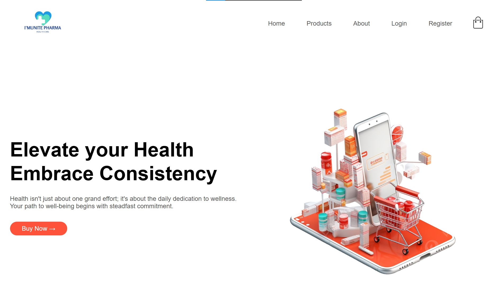
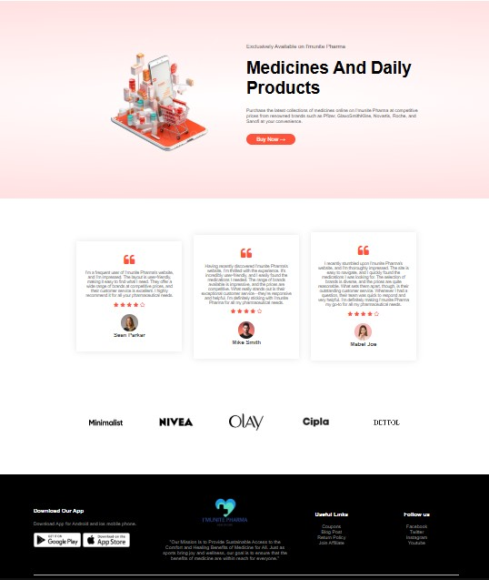
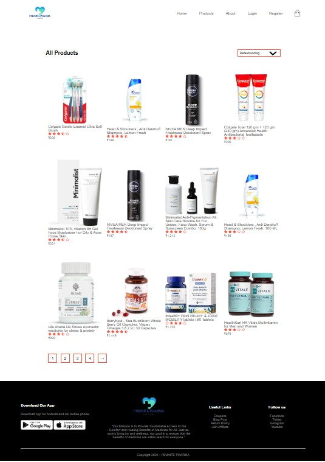
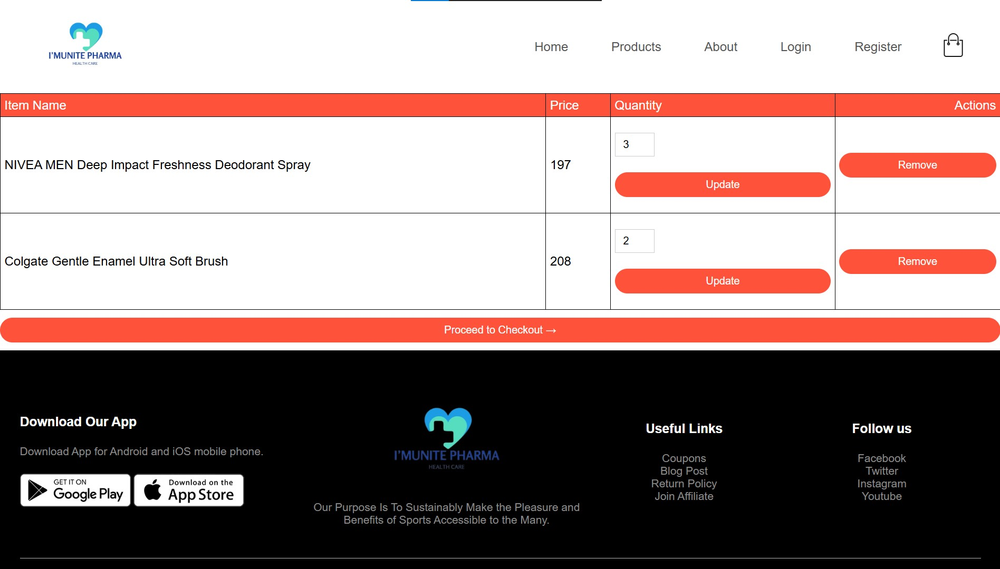
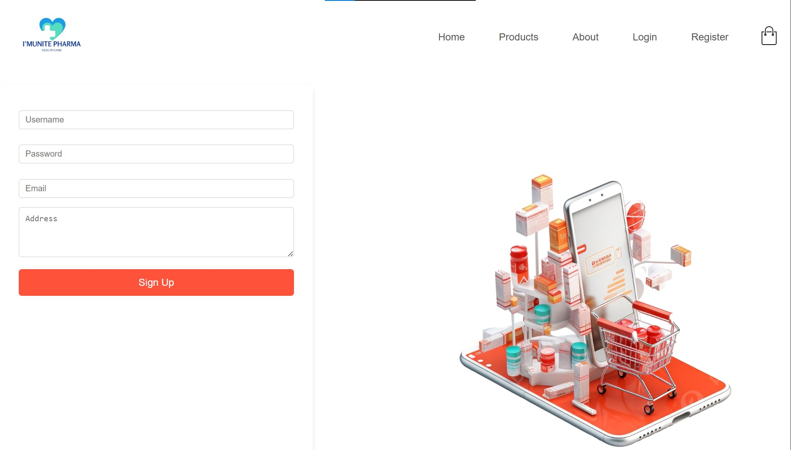

---

# I'MUNITE PHARMA 💊

**I'MUNITE PHARMA** is a simple personal e-commerce web project for browsing and purchasing medicines and healthcare products. It was developed as a self-learning initiative using PHP and MySQL, styled with Bootstrap and powered with JavaScript for dynamic interaction. It is deployed locally using the XAMPP server.

---

## 📌 Table of Contents

- [Tech Stack](#-tech-stack)
- [Features](#-features)
- [Installation & Setup](#-installation--setup)
- [Author](#-author)
- [License](#-license)
- [Screenshots](#-screenshots)

---

## 🛠️ Tech Stack

- **Frontend**: HTML5, CSS3, Bootstrap 4, JavaScript  
- **Backend**: PHP  
- **Database**: MySQL  
- **Server Environment**: XAMPP (Apache + MySQL)

---

## 🚀 Features

- Home page with medicine listings  
- Add to Cart functionality  
- Checkout simulation  
- Responsive design using Bootstrap  
- Localhost-based deployment via XAMPP  
- MySQL integration with dynamic content loading  
- Organized file structure for maintainability  

---

## 📦 Installation & Setup

Follow these steps to run the project locally:

### 1. Clone the Repository

```bash
git clone https://github.com/hanijawad04/IMUNITE-PHARMA.git
````


### 2. Move Project to XAMPP

Copy the entire project folder (`Imunite-Pharma`) into your XAMPP `htdocs` directory:

```
C:\xampp\htdocs\
```

Your folder path should now look like:

```
C:\xampp\htdocs\Imunite-Pharma\
```

### 3. Start XAMPP Server

1. Open **XAMPP Control Panel**
2. Start the following services:

   * ✅ Apache
   * ✅ MySQL

### 4. Import the Database

1. Go to (http://localhost/phpmyadmin) in your browser
2. Click on **New**, and create a new database named:

```
imunite_pharma
```

3. Click on the new database → Go to the **Import** tab
4. Click **Choose File** and select the `.sql` file provided in the project directory
5. Click **Go** to import the tables and data

> Make sure your `.sql` file matches your project database structure.

### 5. Run the Website

Open the following URL in your browser:

```
http://localhost/Imunite-Pharma/
```

You should now see the home page of the I'MUNITE PHARMA website.

---

## 🙋‍♂️ Author

* **Hani Jawad**
* 📧 [hanijawad04@gmail.com](mailto:hanijawad04@gmail.com)
* 🧑‍💻 [GitHub Profile](https://github.com/hanijawad04)

---

## 📄 License

This project is intended for **personal** and **educational** purposes only.
You are free to use, modify, or extend it, but redistribution or commercial use is **not permitted** without permission.

---
## 🖼️ Screenshots

Below are some screenshots of the I'MUNITE PHARMA website interface:

### 🏠 Home Page (Top Section)


### 🏠 Home Page (Middle Section)


### 🏠 Home Page (Footer Section)


### 🛒 Products Listing


### 🧾 Cart Page


### 📝 Register Page



---

